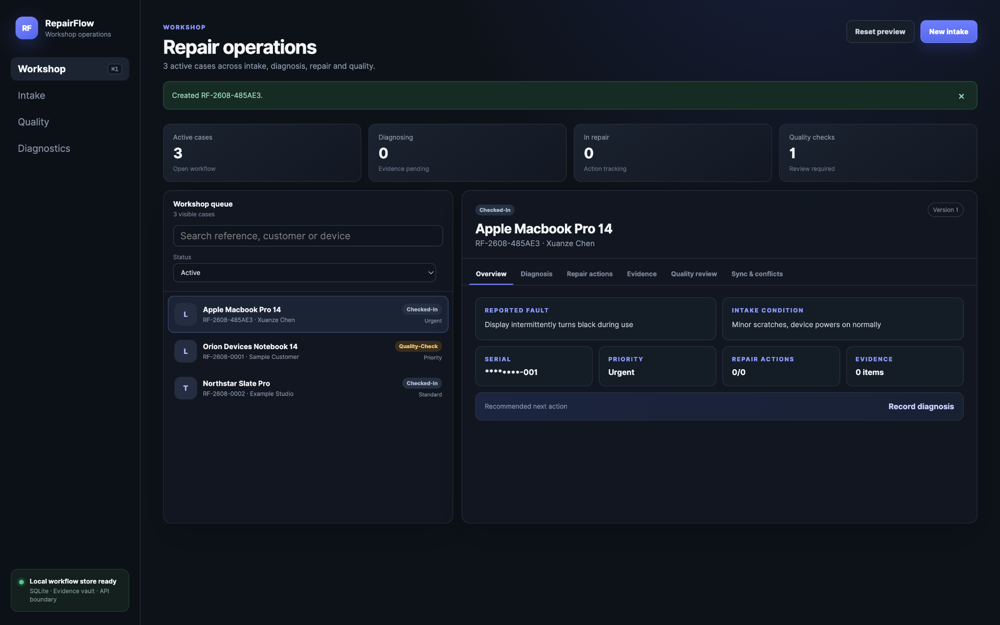
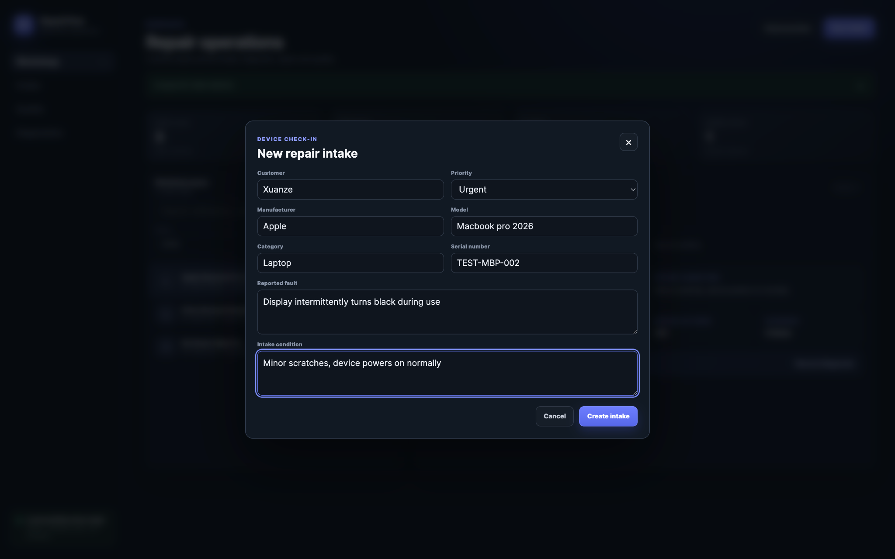
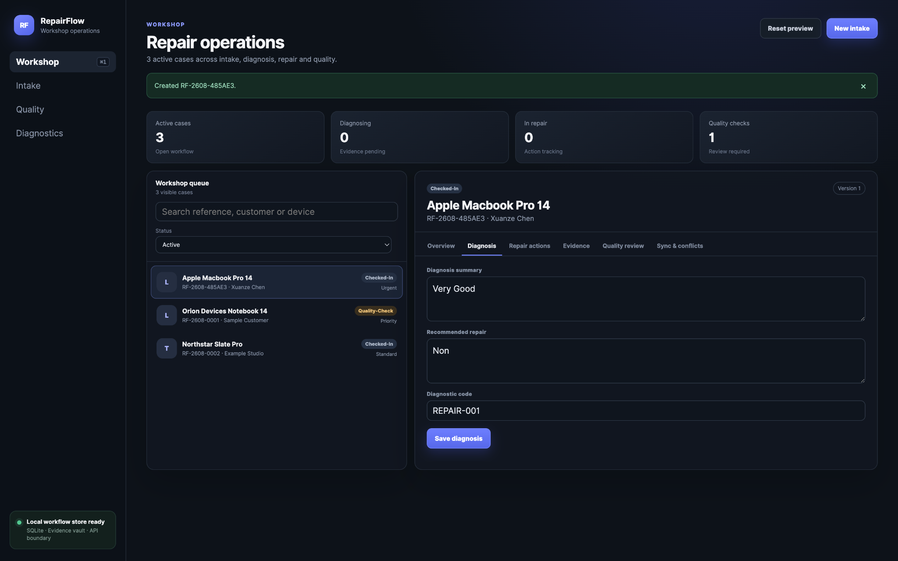
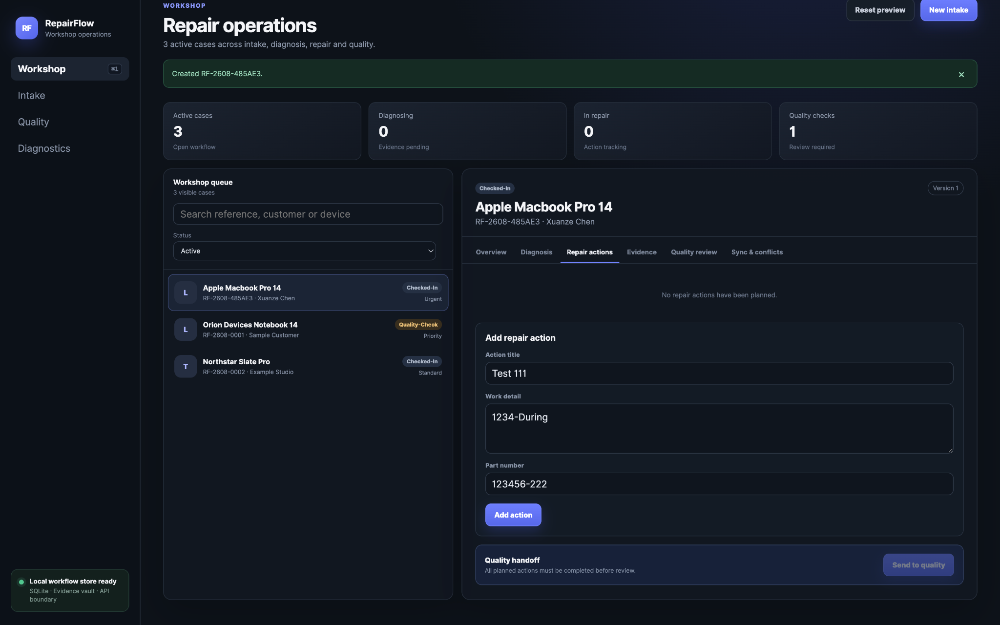
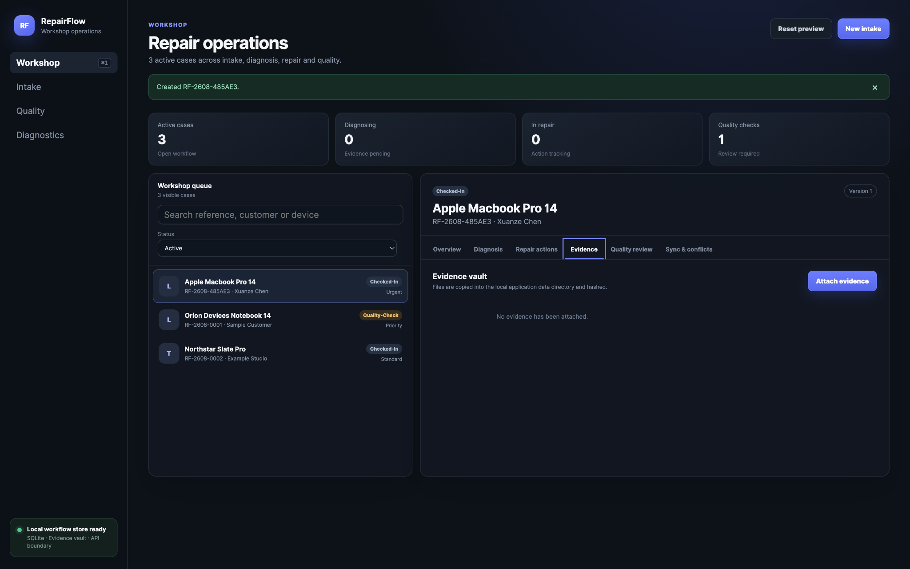
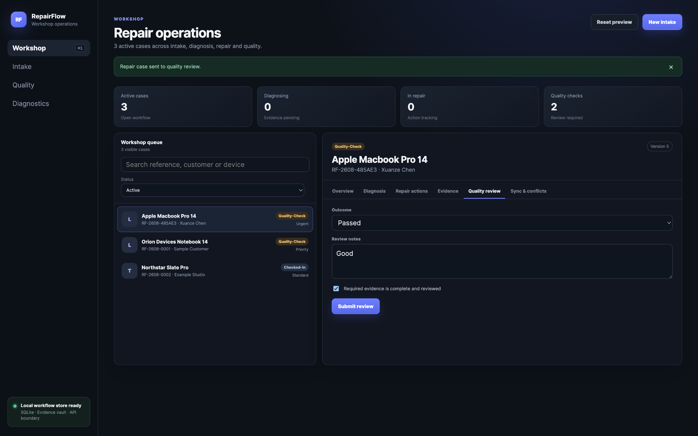
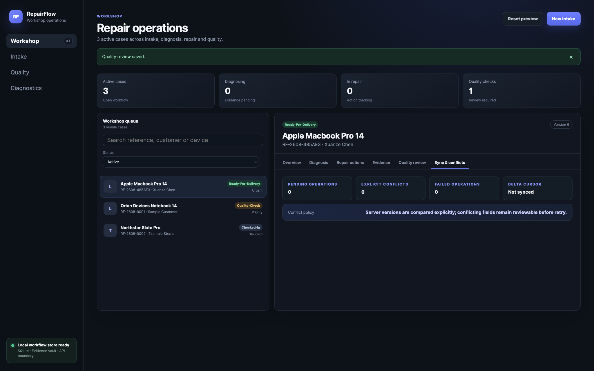
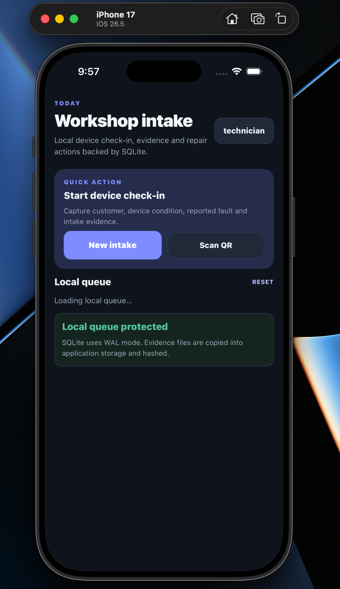
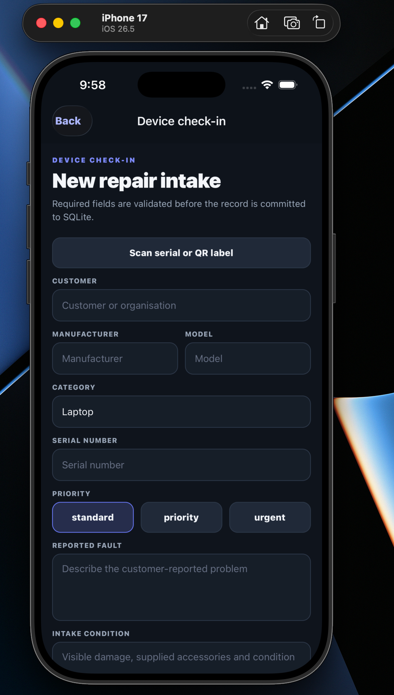
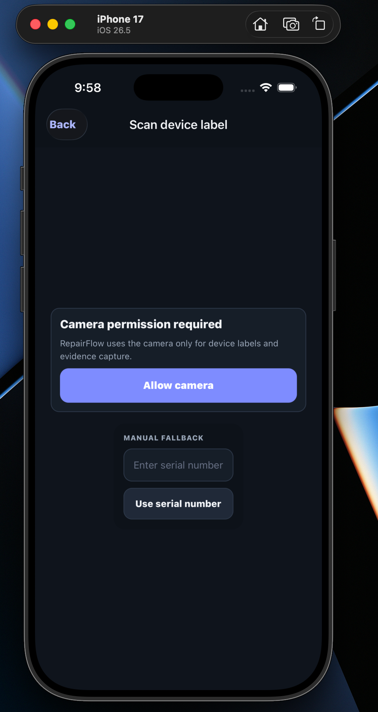

# RepairFlow

RepairFlow is an offline-first repair operations platform for electronics service teams. It connects device check-in, diagnosis, repair actions, evidence handling, quality review and synchronisation across a desktop workshop client, a mobile field client and an ASP.NET Core service.

> Current version: **v1.0.0**

<!-- product-media:start -->

## Product walkthrough

### Workshop overview



_The workshop view brings active cases, workflow status, search, prioritisation and the selected repair case into one operational workspace._

### Desktop repair workflow

| Device check-in                                                                                                              | Diagnosis                                                                                             |
| ---------------------------------------------------------------------------------------------------------------------------- | ----------------------------------------------------------------------------------------------------- |
|                                                    |                                   |
| Captures the customer, device, serial number, priority, reported fault and intake condition before a repair case is created. | Records the technician's diagnosis, recommended repair and diagnostic code against the selected case. |

| Repair actions                                                                                   | Evidence vault                                                                                                       |
| ------------------------------------------------------------------------------------------------ | -------------------------------------------------------------------------------------------------------------------- |
|                      |                                                  |
| Tracks planned work, work detail and part references before the case can move to quality review. | Provides the attachment boundary for repair evidence; selected files are copied into application storage and hashed. |

| Quality review                                                                                     | Synchronisation and conflicts                                                                                            |
| -------------------------------------------------------------------------------------------------- | ------------------------------------------------------------------------------------------------------------------------ |
|                                |                                       |
| Captures the quality outcome, review notes and evidence-completeness confirmation before delivery. | Surfaces pending, conflicting and failed operations together with the current delta cursor and explicit conflict policy. |

### Mobile workflow

| Workshop intake                                                              | Mobile check-in                                                                                   | Device label scan                                                                              |
| ---------------------------------------------------------------------------- | ------------------------------------------------------------------------------------------------- | ---------------------------------------------------------------------------------------------- |
|  |                   |                |
| Starts from an offline-capable local queue backed by SQLite.                 | Captures repair intake data on a phone, including priority and serial/QR-assisted identification. | Requests camera access only when required and keeps a manual serial-number fallback available. |

<!-- product-media:end -->

## Core workflow

`Check-in → condition evidence → diagnosis → repair work → quality verification → delivery`

Repair cases are versioned records. Desktop and mobile clients keep local workflow state and use durable synchronisation operations when a service connection is available. Evidence is stored behind application-owned boundaries and is integrity-checked before transfer.

## Using RepairFlow

### Desktop client

1. Open **Workshop** to review the active queue and select a repair case.
2. Use **New intake** to record the customer, device, serial number, reported fault, intake condition and priority.
3. Open **Diagnosis** on the selected case and save the diagnostic summary and recommended repair.
4. Use **Repair actions** to add work items and mark each item complete.
5. Use **Evidence** to attach supporting files to the case.
6. When all planned work is complete, send the case to **Quality review**.
7. Record the review outcome and notes. A passed review moves the case toward delivery.
8. Use **Sync & conflicts** to inspect pending operations, explicit conflicts, failed operations and the delta cursor.

The v1.0.0 desktop client concentrates operational work in the Workshop workspace. Intake is opened from **New intake**, while diagnosis, repair, evidence, quality and synchronisation are accessed from the selected case tabs.

### Mobile client

1. Open **Workshop intake**.
2. Choose **New intake** to enter a repair case, or **Scan QR** to start from a device label.
3. Select a case from the local queue.
4. Use the case tabs to record diagnosis, repair work and quality review.
5. Mobile records are persisted locally so the workflow remains usable when the service is unavailable.

## Installing packaged builds

Release files are published under [v1.0.0](https://github.com/xuanz3/RepairFlow-Service-Platform/releases/tag/v1.0.0).

| Platform            | Release file                    | Notes                                                                                                                            |
| ------------------- | ------------------------------- | -------------------------------------------------------------------------------------------------------------------------------- |
| macOS Apple Silicon | `RepairFlow-macOS-arm64.zip`    | Unsigned build. Unzip it and use **Open** from Finder's context menu if Gatekeeper asks for confirmation.                        |
| Windows x64         | `RepairFlow-Windows-x64.exe`    | Portable unsigned build.                                                                                                         |
| Linux x64           | `RepairFlow-Linux-x64.AppImage` | Mark the AppImage executable before launching it.                                                                                |
| Android             | `RepairFlow-Android.apk`        | CI verifies native APK generation and release-bundle integrity; physical-device runtime is not part of the current release gate. |
| iOS Simulator       | `RepairFlow-iOS-Simulator.zip`  | Unsigned Simulator build for local verification with Xcode.                                                                      |

### iOS Simulator installation

With an iOS Simulator already booted:

```bash
unzip RepairFlow-iOS-Simulator.zip -d RepairFlow-iOS-Simulator
APP="$(find RepairFlow-iOS-Simulator -type d -name 'RepairFlow.app' | head -1)"
xcrun simctl install booted "$APP"
xcrun simctl launch booted com.xuanz3.repairflow.mobile
```

### Linux AppImage

```bash
chmod +x RepairFlow-Linux-x64.AppImage
./RepairFlow-Linux-x64.AppImage
```

## Retained operational capabilities

- Desktop workshop queue with case search, status filtering and case-level workspaces
- Electron SQLite workflow store behind the context-isolated desktop IPC boundary
- Expo Camera for device-label and evidence capture on mobile
- Playwright desktop end-to-end and accessibility verification
- Maestro mobile workflow contracts

## Platform responsibilities

| Component            | Responsibility                                                                                                        |
| -------------------- | --------------------------------------------------------------------------------------------------------------------- |
| Mobile               | Device check-in, QR/serial lookup, condition evidence, diagnosis, repair actions and local queue                      |
| Desktop              | Workshop queue, case inspection, repair action tracking, evidence, quality verification and conflict visibility       |
| Service              | Identity, role policies, workflow rules, PostgreSQL persistence, audit records, OpenAPI and synchronisation endpoints |
| Local infrastructure | PostgreSQL and Azurite through Docker Compose, with optional Prometheus and Grafana observability                     |

## Technology

- React Native + Expo for iOS and Android
- Electron + React + TypeScript for Windows, macOS and Linux
- ASP.NET Core and C# for the service layer
- PostgreSQL for central service data
- SQLite for Electron and mobile local workflow stores
- Expo Camera, FileSystem, Crypto and SecureStore for mobile capture boundaries
- pnpm workspaces and Turborepo for the shared TypeScript workspace
- xUnit, Vitest, Playwright and Maestro for workflow verification
- OpenTelemetry, Prometheus and Grafana for reliability telemetry
- GitHub Actions for validation, cross-platform builds and release checks

## Repository structure

```text
apps/
  api/       ASP.NET Core workflow service
  desktop/   Electron workshop client
  mobile/    React Native intake and repair client
packages/
  api-client/
  contracts/
  design-tokens/
  sync-engine/
  validation/
docs/
  evidence/
  images/product/
  releases/
infra/
  docker-compose.yml
tools/
  dev/
  release/
  verify/
```

## Running from source

Requirements:

- Node.js 22.13 or newer
- pnpm 11.9
- .NET SDK 10
- Docker Desktop

Install and verify the repository:

```bash
pnpm install --frozen-lockfile
dotnet restore apps/api/RepairFlow.sln --locked-mode
pnpm verify
dotnet build apps/api/RepairFlow.sln --configuration Release --no-restore
dotnet test apps/api/RepairFlow.sln --configuration Release --no-build
```

Start local infrastructure and the applications:

```bash
./tools/dev/start-local.command
dotnet run --project apps/api/src/RepairFlow.Api
pnpm --filter @repairflow/desktop dev
pnpm --filter @repairflow/mobile start
```

The desktop end-to-end suite can be run separately:

```bash
pnpm --filter @repairflow/desktop exec playwright install chromium
pnpm e2e:desktop
```

## Verification and release controls

The repository keeps package creation separate from product-media capture. The v1 release gate verifies repository contracts, TypeScript and .NET builds, unit tests, desktop end-to-end and accessibility checks, service configuration, reliability scenarios and deterministic package generation.

The Phase 4 release workflow produces:

- `RepairFlow-macOS-arm64.zip`
- `RepairFlow-Windows-x64.exe`
- `RepairFlow-Linux-x64.AppImage`
- `RepairFlow-Android.apk`
- `RepairFlow-iOS-Simulator.zip`
- build metadata, SHA-256 checksums, a CycloneDX SBOM, release notes and known limitations

Curated screenshots in this README are documentation. They are deliberately kept outside the blocking release gate.

## Data and security

All example customers, devices, serial numbers and attachments in this repository are fictional or generated. Customer files, device unlock credentials and long-lived secrets must not be committed.

The desktop client isolates Electron IPC boundaries, mobile data is kept in application-owned storage, service operations use role policies and version checks, and evidence upload paths include integrity verification and explicit recovery states.

## Delivery stages

| Stage   | Purpose                                                          | Status   |
| ------- | ---------------------------------------------------------------- | -------- |
| Phase 0 | Product definition, design direction and repository governance   | Complete |
| Phase 1 | Platform foundation, backend, identity and shared contracts      | Complete |
| Phase 2 | Desktop and mobile repair workflows                              | Complete |
| Phase 3 | Offline synchronisation, reliability, security and observability | Complete |
| Phase 4 | Cross-platform packaging and the v1.0 release                    | Complete |

## Known limitations

See [`docs/releases/KNOWN_LIMITATIONS_V1.md`](docs/releases/KNOWN_LIMITATIONS_V1.md) for signing, distribution and device-verification boundaries.

## Licence

MIT
