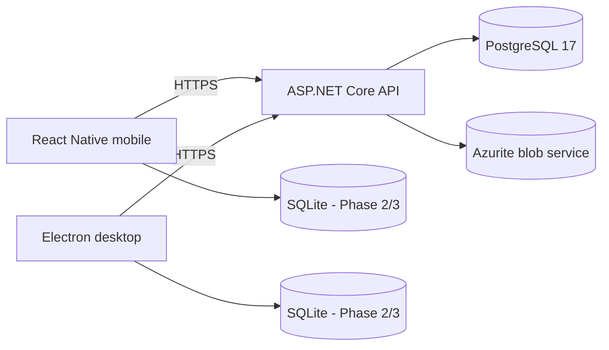

# Local Service Topology

Ports are intentionally non-default where practical:

| Service       | Local port |
| ------------- | ---------: |
| API           |       5098 |
| PostgreSQL    |      55440 |
| Azurite Blob  |      10000 |
| Azurite Queue |      10001 |
| Azurite Table |      10002 |
