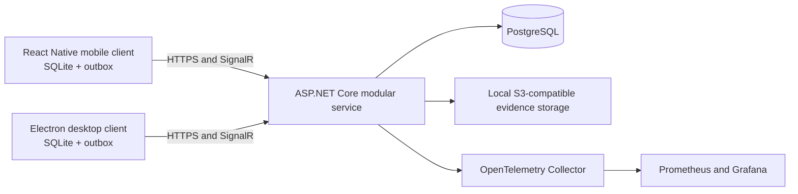

# System Overview

## Boundaries

- Clients write locally before attempting network operations.
- The service owns authorisation, state transitions and idempotency.
- Evidence bytes are stored separately from evidence metadata.
- The service remains a modular monolith for v1.
- Background workers are introduced only when measured workloads justify them.
